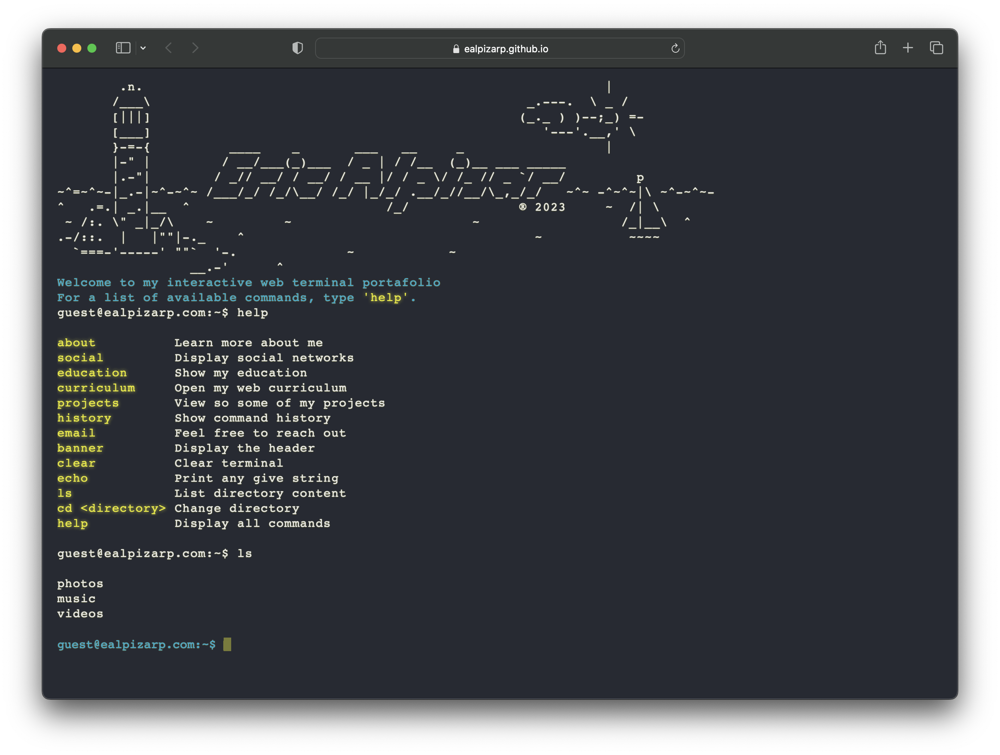
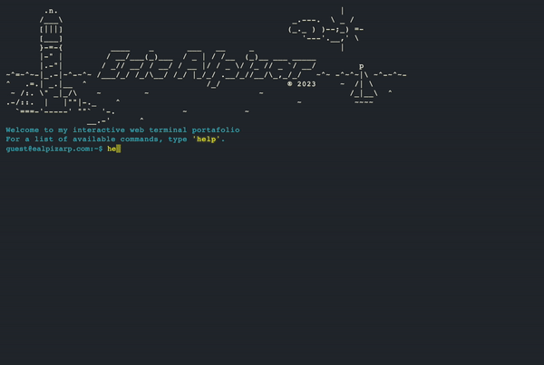

## Personal CLI Portfolio Website

This is a personal portfolio website with a unique CLI-inspired user interface. The website features some of my projects, contact information,
education and other information.

## Tech Stack

**JavaScript**

**HTML**

**CSS**

### Features

- Unique CLI-inspired user interface 

- Interactive and immersive design

- Responsive design

- Command history (prev and next with arrow keys)

- A bunch of easter eggs!

 

  

 

### Usage
To use the website, simply open the website URL in a web browser and start exploring. The website is optimized for modern web browsers and also has mobile devices support.

### License
This project is licensed under the MIT License - see the LICENSE.md file for details.

### Inspiration

I was inspired by the following terminal based portafolio websites.

* [Forest](https://fkcodes.com/)
* [SatNiang](https://github.com/satnaing/terminal-portfolio)